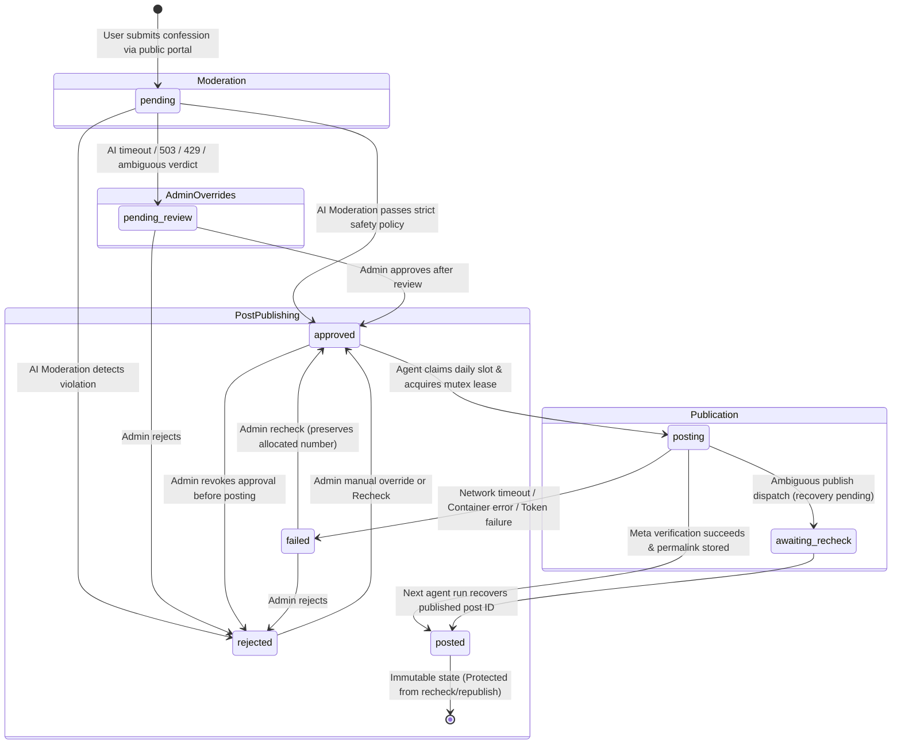

# BUConfess v3.5 — Complete System Architecture & Engineering Guide

## 1. Executive Summary & Purpose

**BUConfess** is an enterprise-grade, privacy-first anonymous confession and automated publishing platform designed for campus communities. It bridges anonymous student confessions submitted via a public web portal with autonomous moderation, high-fidelity Instagram carousel rendering, automated social media publication, and resilient secondary telemetry.

### Core Architectural Principles
1. **Zero Data Loss & Strict Anonymity**: Confessions are stored securely in PostgreSQL with cryptographic one-way salted IP hashing (`HMAC-SHA256`). No identifiable personal data is ever recorded.
2. **Decoupled Autonomous Pipeline**: Submission, moderation, image rendering, Instagram publication, and Google Sheets sync operate as decoupled stages. Failure in a secondary subsystem (e.g., Google Sheets) never degrades or halts core publication.
3. **Atomic Sequence Numbering**: Confession numbers are allocated strictly monotonically through a native PostgreSQL sequence (`confession_number_seq`). Race conditions and duplicate numbers are mechanically impossible under high concurrency.
4. **Idempotent, Ambiguity-Proof Publishing**: External Instagram API dispatches use 128-bit cryptographic correlation tokens and two-stage container status polling. If a network drop occurs during publication dispatch, an ambiguous-recovery engine verifies live Meta state before any retry, guaranteeing **zero duplicate posts**.
5. **Authoritative Schedule with External Heartbeat**: The database (`public.settings` and `public.daily_posting_runs`) is the authoritative source of truth for posting time and daily execution slots. GitHub Actions serves solely as an external clock/heartbeat, eliminating the need to edit CI/CD YAML files when operational schedules change.
6. **Universal Typography & Emoji Safety**: Full Unicode 15.0 coverage via bundled open-source vector fonts, grapheme-cluster-safe text segmentation (`Intl.Segmenter`), and Zero Width Joiner (`\u200D`) sequence preservation.

---

## 2. High-Level Architecture Diagram

```mermaid
flowchart TD
    subgraph PublicPortal ["1. Public Submission Layer (apps/public)"]
        User(["Student / User"]) -->|Anonymous Submission| WebApp["Next.js Public App (Vercel)"]
        WebApp -->|HMAC-SHA256 Salted Hash| IPHash["Privacy Layer"]
        WebApp -->|Distributed Rate Limit| RateLimit["public.rate_limits"]
        IPHash -->|Insert status='pending'| DB_Confessions[("Supabase PostgreSQL: public.confessions")]
    end

    subgraph AdminPortal ["2. Admin Operations Dashboard (apps/admin)"]
        AdminUser(["Campus Moderator"]) -->|Secure Login / Session| AdminApp["Next.js Admin App (Vercel)"]
        AdminApp -->|JWT Auth + Anti-CSRF| AdminAPI["Admin API Routes"]
        AdminAPI -->|Review & Override| DB_Confessions
        AdminAPI -->|Recheck / Remoderate| ModCascade
        AdminAPI -->|Live Settings Update| DB_Settings[("public.settings")]
        AdminAPI -->|Audit Trail| DB_Audit[("public.audit_log")]
    end

    subgraph AutonomousWorker ["3. Autonomous Daily Agent (scripts/run-agent.ts)"]
        GH_Cron["GitHub Actions Heartbeat (Node 22)"] -->|Periodic Wakeup / Dispatch| Agent["Daily Posting Agent"]
        Agent -->|1. Mutex Lease & Heartbeat| DB_Locks[("public.agent_locks")]
        Agent -->|2. Schedule Gating & Slot Claim| DB_Slots[("public.daily_posting_runs")]
        Agent -->|3. Read Active Configuration| DB_Settings
        Agent -->|4. Token Preflight| MetaAuth["Instagram Token Preflight"]
        Agent -->|5. Fetch 'pending' Confessions| DB_Confessions
    end

    subgraph ModerationPipeline ["4. AI Moderation Cascade (apps/admin/lib/ai/)"]
        Agent -->|Batch Confessions| ModCascade{"Flash Model Cascade"}
        ModCascade -->|Primary| G25F["gemini-2.5-flash"]
        ModCascade -->|Fallback 1| G25FL["gemini-2.5-flash-lite"]
        ModCascade -->|Fallback 2| G35F["gemini-3.5-flash"]
        ModCascade -->|Fallback 3| G38F["gemini-3.8-flash"]
        G25F -- 503 / 429 / Timeout --> G25FL
        G25FL -- 503 / 429 / Timeout --> G35F
        G35F -- 503 / 429 / Timeout --> G38F
        ModCascade -->|Approved| DB_Approve["status='approved'"]
        ModCascade -->|Rejected| DB_Reject["status='rejected'"]
        ModCascade -->|All Models Fail| DB_Review["status='pending_review' (Never Auto-Reject)"]
    end

    subgraph RenderingPipeline ["5. Universal Canvas & Storage (apps/admin/lib/canvas/)"]
        Agent -->|Fetch 'approved' Confessions| ImageEngine["@napi-rs/canvas Renderer"]
        ImageEngine -->|Geist + Noto Emoji OFL| FontEngine["Grapheme-Safe Font Engine"]
        ImageEngine -->|Draw Atomic Number| NumberSeq[("PostgreSQL Sequence: confession_number_seq")]
        ImageEngine -->|Split 4:5 Slides| CardSlices["1080x1350 PNG Slides (Max 10)"]
        CardSlices -->|Upload Artifacts| Storage[("Supabase Storage: confessions-images")]
    end

    subgraph PublicationCore ["6. Instagram Publication Subsystem (apps/admin/lib/instagram/)"]
        Agent -->|Pre-API Attempt Persistence| DB_Attempts[("public.instagram_publish_attempts")]
        Agent -->|Upload Carousel Items| IG_Child["Meta Graph API: Child Containers"]
        Agent -->|Poll to FINISHED| IG_PollChild{"Polling Engine"}
        IG_PollChild -->|Create Parent Carousel| IG_Parent["Meta Graph API: Carousel Container"]
        Agent -->|Poll to FINISHED| IG_PollParent{"Polling Engine"}
        IG_PollParent -->|Dispatch media_publish| IG_Publish["Meta Graph API: Publish (maxRetries=0)"]
        IG_Publish -->|Verify Live Post| IG_Verify["Meta Graph API: GET permalink"]
        IG_Verify -->|Success| DB_Posted["status='posted', ig_post_id populated"]
        IG_Publish -- Transport Error --> IG_Recovery{"Ambiguous Recovery Protocol"}
        IG_Recovery -->|Match Correlation Token| DB_Posted
    end

    subgraph SecondarySync ["7. Secondary Google Sheets Sync (apps/admin/lib/sheets/)"]
        DB_Posted -->|Non-Blocking Async Dispatch| SheetsSync["Google Sheets Sync Service"]
        SheetsSync -->|Append / Idempotent Update| GSheets[("Google Sheets Spreadsheet")]
        SheetsSync -->|Telemetry & Error Logging| DB_SheetsLog[("public.sheets_sync_log")]
    end
```



---

## 3. Monorepo Structure & Organization

The codebase is organized as a clean TypeScript monorepo containing two Next.js applications, automation scripts, SQL migrations, and an exhaustive integration test matrix.

```
buconfess/
├── .github/
│   └── workflows/
│       └── daily-post.yml          # GitHub Actions heartbeat (Node 22, npm ci, run-agent)
├── apps/
│   ├── public/                     # Public confession submission portal
│   │   ├── app/
│   │   │   ├── api/confessions/    # Anonymous confession intake API
│   │   │   ├── page.tsx            # Modern Apple-inspired submission UI
│   │   │   └── terms, privacy...   # Legal & compliance pages
│   │   ├── lib/
│   │   │   ├── rateLimit.ts        # Distributed IP rate limiter
│   │   │   └── supabase.ts         # Anon-key Supabase client (RLS restricted)
│   │   └── tsconfig.json
│   │
│   └── admin/                      # Operations & moderation management portal
│       ├── app/
│       │   ├── api/admin/          # Protected administration APIs
│       │   │   ├── login, logout   # JWT cookie session handlers
│       │   │   ├── confessions/    # Moderation & recheck endpoints
│       │   │   ├── settings/       # Runtime operational configuration
│       │   │   ├── sync/retry/     # Secondary Sheets sync retry queue
│       │   │   └── lease/          # Stale agent lock release
│       │   ├── login/page.tsx      # Secure administrator login page
│       │   └── page.tsx            # Multi-view moderation dashboard
│       ├── assets/fonts/           # Bundled typography assets
│       │   ├── Geist-Regular.ttf   # Body & header text font
│       │   ├── Geist-Bold.ttf      # Card numbering & branding font
│       │   └── NotoColorEmoji.ttf  # Unicode 15.0 COLRv1 full-color vector emoji font (OFL 1.1)
│       ├── components/             # React dashboard components (RecheckView, etc.)
│       ├── lib/                    # Shared enterprise library
│       │   ├── ai/                 # Gemini SDK moderation cascade & retry policy
│       │   ├── canvas/             # Native canvas image generation & slide splitter
│       │   ├── instagram/          # Resilient Meta Graph API publishing core
│       │   ├── sheets/             # Google Sheets secondary sync & retry logic
│       │   ├── auth.ts             # JWT token verification & bcrypt credentials
│       │   ├── schedule.ts         # Authoritative schedule window evaluator
│       │   ├── settings.ts         # Typed runtime settings allowlist & validation
│       │   └── agentLock.ts        # Distributed lease-based concurrency locking
│       ├── middleware.ts           # Route guard, JWT verification, CSRF validation
│       └── tsconfig.json
│
├── scripts/
│   └── run-agent.ts                # Autonomous agent orchestration pipeline
├── supabase/
│   └── migrations/
│       ├── 001_initial_schema.sql  # Baseline tables, RLS policies, audit logs
│       ├── 002_atomic_confession_number_allocation.sql # Monotonic sequence allocator
│       └── 003_v35_production_upgrade.sql # daily_posting_runs, sheets_sync_log, v3.5 settings
└── test/                           # 17 Test suites (852 assertions, 100% pass)
    ├── admin-auth-v35.test.ts
    ├── canvas-emoji-typography-v35.test.ts
    ├── gemini-cascade-v35.test.ts
    ├── instagram-publication.test.ts
    ├── numbering-allocation.test.ts
    ├── recheck-v35.test.ts
    ├── schedule-v35.test.ts
    └── sheets-sync-v35.test.ts
```

---

## 4. Confession Lifecycle & State Machine

Every confession submitted to BUConfess transitions through a deterministic, strictly enforced finite state machine.



### State Definitions & Security Invariants
- **`pending`**: Stored in DB with hashed IP, `number = null`, `image_urls = null`. No image is generated yet.
- **`rejected`**: Confession failed moderation. No sequence number is ever consumed. Stored for compliance audit.
- **`pending_review`**: Confession flagged due to high sensitivity or complete Gemini API cascade unavailability. **Never auto-rejected.**
- **`approved`**: Eligible for daily automated publication. Waiting in queue.
- **`posting`**: Agent is currently generating images and dispatching to Meta. Protected by `agent_locks`.
- **`posted`**: **Permanently immutable**. Has an active Instagram post (`ig_post_id` is populated). Recheck or duplicate publication is **strictly blocked at both API and database layers**.
- **`failed`**: An error occurred during image generation or upload. Existing sequence number (if allocated) is retained to preserve monotonicity.

---

## 5. Detailed Subsystems

### 5.1 Subsystem A: Public Submission & Privacy Layer (`apps/public`)
- **Privacy & Anonymity**: Client IP addresses are hashed using `HMAC-SHA256` salted with a private server secret (`IP_HASH_SECRET`). Raw IP addresses are discarded immediately and never touch logs or databases.
- **Distributed Rate Limiting**: The `public.rate_limits` table tracks submission frequency per hashed IP using atomic PostgreSQL upserts (`ON CONFLICT (key) DO UPDATE`).
- **Database Row-Level Security (RLS)**: The public application connects to Supabase using the anonymous key (`NEXT_PUBLIC_SUPABASE_ANON_KEY`). RLS policy `anon_insert_confessions` permits `INSERT` only. Anonymous clients have **zero read access** to any table in the database.

---

### 5.2 Subsystem B: Admin Operations Dashboard (`apps/admin`)
- **Authentication**: Admin credentials (`ADMIN_USERNAME` and bcrypt-hashed `ADMIN_PASSWORD_HASH`) are verified server-side. Successful logins issue an `admin_token` signed with `JWT_SECRET`.
- **Cookie Security**:
  - `httpOnly: true` (Inaccessible to JavaScript, immune to XSS token theft).
  - `sameSite: 'lax'` (CSRF defense).
  - `path: '/'`.
  - `secure: process.env.NODE_ENV === 'production'`.
  - `maxAge: 604800` (7 days).
- **Anti-CSRF Engine**: In [middleware.ts](file:///c:/Users/vikra/Downloads/Projects/buconfess/apps/admin/middleware.ts), state-changing requests (`POST`, `PUT`, `DELETE`, `PATCH`) must validate:
  1. Header origin/host equivalence.
  2. The custom anti-CSRF header: `x-admin-action: 1`.
- **Operational Views**:
  - **Moderation Queue**: Tabbed management for `Pending`, `Approved`, `Rejected`, `Pending Review`, and `Posted`.
  - **Recheck Interface**: Safe bulk or single recheck for past rejected/failed items.
  - **Settings Management**: Live modification of operational parameters (batch size, posting time, font size, etc.) without redeploying code.
  - **Audit Log**: Immutable audit entries recording actor, action, confession ID, and state deltas.

---

### 5.3 Subsystem C: Autonomous Daily Agent (`scripts/run-agent.ts`)
The agent is an autonomous, idempotent TypeScript CLI process executed on a schedule:
1. **GitHub Actions Heartbeat**: Wakes up periodically (e.g., every 30 minutes) via `.github/workflows/daily-post.yml`.
2. **Durable Agent Mutex Lease (`public.agent_locks`)**:
   - Acquires lock `daily_agent_run` with TTL (default 300s).
   - If another instance is running and healthy, exits immediately with code 0.
   - Launches a background heartbeat timer renewing the lease every 90s.
   - If lease is usurped or expires, worker aborts immediately (Split-brain prevention).
3. **Authoritative Schedule Window Evaluation (`public.daily_posting_runs`)**:
   - Reads `daily_posting_time` (e.g. `"22:00"`) and `posting_timezone` (e.g. `"Asia/Kolkata"`).
   - Calculates time difference $\Delta t = t_{\text{current}} - t_{\text{target}}$.
   - Checks gating window: $-5\text{m} \le \Delta t \le +25\text{m}$.
   - If outside window, skips publication and exits clean.
   - If inside window, atomically attempts to claim the slot via:
     ```sql
     INSERT INTO public.daily_posting_runs (posting_date, schedule_slot, status)
     VALUES ('2026-09-19', '22:00', 'running');
     ```
   - If `daily_posting_runs_date_slot_key` unique constraint trips (SQLSTATE 23505), slot was already run today $\to$ skips publication.
4. **Token Preflight**: Validates the Instagram Graph API token before processing confessions. If token is invalid/expired, aborts safely before touching queue.
5. **Dry-Run Mode**: CLI flag `--dry-run` or environment variable `DRY_RUN=true` executes full moderation, image generation, and publication simulations, writing a diagnostic JSON report artifact without mutating databases, consuming slots, or dispatching external API calls.

---

### 5.4 Subsystem D: Resilient AI Moderation Cascade (`apps/admin/lib/ai/`)
Moderation leverages Google Gemini Flash models configured in an automatic fallback cascade:

```
gemini-2.5-flash (Primary)
      │ (503 / 429 / Timeout)
      ▼
gemini-2.5-flash-lite (Fallback 1)
      │ (503 / 429 / Timeout)
      ▼
gemini-3.5-flash (Fallback 2)
      │ (503 / 429 / Timeout)
      ▼
gemini-3.8-flash (Fallback 3)
      │ (Exhausted)
      ▼
status = 'pending_review' (Human Operator Review)
```

- **Allowlist Enforcement**: Configured via database setting `moderation_model_cascade`. Only verified Google Gemini Flash models can be specified. Unsupported or retired model IDs (e.g., deprecated `gemini-1.5-flash`) are strictly rejected.
- **Bounded Retry Logic**:
  - `503 Service Unavailable`: Max 1 short retry with 500ms backoff before cascading.
  - `timeout`: Max 1 retry with a bounded 10s budget before cascading.
  - `429 Rate Limit`: Honors `Retry-After` header only if $\le 3000\text{ms}$; otherwise cascades immediately.
  - `400/401/403 Client Errors`: Zero retries, immediate cascade.
- **Fail-Safe Invariant**: If every model in the cascade fails, the confession status is set to `pending_review` with structured error telemetry. **It is never automatically rejected due to AI provider outages.**

---

### 5.5 Subsystem E: Universal Canvas & Typography Rendering (`apps/admin/lib/canvas/`)
Confessions are rendered into high-resolution, branded 1080x1350 PNG images (Instagram 4:5 portrait ratio) using `@napi-rs/canvas`:

- **Font Fallback Chain**:
  1. `Geist-Regular` / `Geist-Bold`: High-legibility typography for English, Hindi (Devanagari), and standard text.
  2. `NotoColorEmoji`: Bundled Google Noto Color Emoji COLRv1 vector font (Unicode 15.0, SIL Open Font License 1.1) providing modern, full-color, high-resolution rendering for:
     - Smileys, people, skin-tone modifiers (`👍🏽`, `👩🏽‍💻`, `🤝🏻`, `🫶`, `🫠`).
     - Zero Width Joiner (ZWJ) sequences (`👨‍👩‍👧‍👦`, `❤️‍🔥`, `👨‍💻`, `👩‍🎓`).
     - Symbols, flags (`🇮🇳`, `🏳️‍🌈`), keycaps, and variation selectors.
- **Grapheme Cluster Segmentation**:
  Text is broken into graphemes using `Intl.Segmenter(undefined, { granularity: 'grapheme' })`. The regex in [splitter.ts](file:///c:/Users/vikra/Downloads/Projects/buconfess/apps/admin/lib/canvas/splitter.ts) explicitly preserves `\u200D` so multi-byte emojis are never split across word boundaries or slide splits.
- **Slide Splitting & Pagination**:
  Long confessions are automatically broken into sequential carousel slides (up to `max_slide_count = 10`), each featuring header branding, the assigned confession number (`#24`), pagination markers (`2/3`), and submission bio links.
- **Storage Persistence**: Rendered slides are stored in Supabase Storage bucket `confessions-images` with public CDN URLs persisted in `confessions.image_urls`.

---

### 5.6 Subsystem F: Atomic Sequence Numbering (`apps/admin/lib/canvas/pipeline.ts`)
To prevent numbering gaps, double allocations, or concurrency race conditions:
1. **PostgreSQL Native Sequence**: The database maintains `confession_number_seq`.
2. **Atomic Drawing Function**:
   ```sql
   CREATE OR REPLACE FUNCTION public.allocate_confession_number(p_confession_id bigint)
   RETURNS integer AS $$
   ...
     UPDATE public.confessions
     SET number = nextval('public.confession_number_seq')
     WHERE id = p_confession_id AND number IS NULL
     RETURNING number;
   ...
   $$ LANGUAGE plpgsql;
   ```
3. **Execution Invariants**:
   - Rejected confessions are never assigned a number.
   - Pending review confessions are never assigned a number.
   - Numbers are drawn only when an approved confession enters image generation.
   - If a confession already has a number (e.g., during recheck of a network failure), the existing number is strictly preserved.

---

### 5.7 Subsystem G: Instagram Publication Core (`apps/admin/lib/instagram/`)
The Instagram publisher implements a fault-tolerant, stateful protocol with zero duplicate dispatch risk:

```
[Pre-API Persistence] -> Create attempt record with correlation_token BUC-[32 hex chars]
        │
[Child Containers]    -> Create 1..N item containers with is_carousel_item=true
        │                Persist child IDs immediately to DB
[Poll Status]         -> Poll Meta Graph API until status_code = 'FINISHED'
        │
[Parent Container]    -> Create carousel container referencing child IDs
        │                Persist parent container ID immediately to DB
[Poll Status]         -> Poll Meta Graph API until status_code = 'FINISHED'
        │
[Media Publish]       -> POST /{ig_user_id}/media_publish?creation_id={parent_id}
        │                STRICT INVARIANT: maxRetries = 0 (Never blind retry!)
        ▼
   [Did Network Drop?]
   ├── NO  -> [Meta GET Verification] -> GET /{ig_post_id} -> Verify permalink -> status='posted'
   └── YES -> [Ambiguous Recovery Protocol]
              ├── Query Meta /{ig_user_id}/media for recent posts
              ├── Search caption for correlation token BUC-xxxx
              ├── FOUND -> Recover ig_post_id -> status='posted' (Zero Duplicate Post!)
              └── NOT FOUND -> Mark status='awaiting_recheck' (Recover on next cycle)
```

---

### 5.8 Subsystem H: Decoupled Secondary Google Sheets Sync (`apps/admin/lib/sheets/`)
- **Completely Independent**: Core Instagram posting never halts or rolls back if Google Sheets credentials are missing, revoked, or rate-limited.
- **Fail-Safe Telemetry**: If the Sheets API throws an error (e.g. 429 quota), the confession status remains `posted`, Supabase sets `confessions.sheets_sync_status = 'failed'`, and logs the exact error in `public.sheets_sync_log`.
- **Idempotency**: Before appending, the sync engine searches existing sheet rows by Confession Number and Database ID, updating existing rows in place to prevent duplicate records.
- **Retry Queue**: Admins can trigger `/api/admin/sync/retry` from the dashboard to flush all pending/failed rows once quotas reset.

---

## 6. Runtime Configuration & Settings Matrix

All operational behavior is controlled through the `public.settings` table in Supabase. Values are validated and cached in-memory with a 10-second TTL:

| Setting Key | Type | Default | Constraints | Description |
| :--- | :---: | :---: | :---: | :--- |
| `posting_enabled` | `boolean` | `true` | - | Master switch. If `false`, automated publishing is paused. |
| `auto_publish_approved` | `boolean` | `true` | - | If `false`, approved confessions remain in queue without posting. |
| `daily_posting_time` | `string` | `"22:00"` | `HH:MM` | Target daily posting time in 24-hour format. |
| `posting_timezone` | `string` | `"Asia/Kolkata"` | Valid IANA | Timezone evaluated for the daily schedule window. |
| `max_per_batch` | `number` | `10` | 1–100 | Maximum confessions processed per agent run. |
| `max_daily_posts` | `number` | `50` | 1–500 | Daily publishing limit (resets midnight in `posting_timezone`). |
| `min_delay_between_posts_sec` | `number` | `60` | 10–3600 | Pacing interval in seconds between consecutive carousel posts. |
| `dry_run_mode` | `boolean` | `false` | - | Runs agent in simulation mode without mutating DB or Instagram. |
| `image_font_size` | `number` | `34` | 24–48 | Body font size in pixels for rendered confession cards. |
| `image_line_height` | `number` | `50` | 32–70 | Line height in pixels for rendered confession cards. |
| `max_slide_count` | `number` | `10` | 1–10 | Maximum slides rendered per carousel. |
| `image_retention_days` | `number` | `30` | 1–365 | Storage retention period before cleaning old confession images. |
| `moderation_strictness` | `string` | `"medium"` | low, medium, high | Moderation policy strictness preset. |
| `moderation_model_cascade` | `string` | `"gemini-2.5-flash,..."` | Allowlist | Comma-separated Gemini model fallback cascade. |
| `heartbeat_timeout_sec` | `number` | `90` | 30–600 | Agent lock heartbeat lease renewal interval. |
| `stale_lease_threshold_sec` | `number` | `300` | 60–1800 | TTL after which an unrenewed agent lock is considered stale. |
| `sheets_sync_enabled` | `boolean` | `true` | - | Enable secondary Google Sheets sync on successful publish. |
| `sheets_sync_max_retries` | `number` | `3` | 1–10 | Maximum automatic retries for failed Sheets sync operations. |

---

## 7. Database Schema & Migration History

### Migration 001: Initial Core Schema (`001_initial_schema.sql`)
- **`public.confessions`**: Primary confession entity with text, hashed IP, status enum, sequential number, slide URLs, and Instagram post metadata.
- **`public.settings`**: Key-value JSONB operational store.
- **`public.audit_log`**: Immutable administration and moderation audit trail.
- **`public.agent_runs`**: Execution log of all agent runs.
- **`public.agent_locks`**: Distributed mutual exclusion lease table.
- **`public.instagram_publish_attempts`**: Pre-API correlation and attempt persistence.
- **`public.rate_limits`**: IP hash bucket rate-limiter table.

### Migration 002: Atomic Sequence Numbering (`002_atomic_confession_number_allocation.sql`)
- **`public.confession_number_seq`**: Dedicated sequence generator for confession numbers.
- **`public.allocate_confession_number(bigint)`**: PL/pgSQL function ensuring atomic assignment without race conditions.

### Migration 003: Production Reliability & Operations Upgrade (`003_v35_production_upgrade.sql`)
- **`public.daily_posting_runs`**: Durable daily schedule slot claim table with `UNIQUE(posting_date, schedule_slot)`.
- **`public.sheets_sync_log`**: Secondary Google Sheets sync retry tracking with `UNIQUE(confession_id)`.
- **v3.5 Operational Settings Seeds**: Persists default schedule (`22:00`), timezone (`Asia/Kolkata`), typography (34px/50px), model cascade, and Sheets sync controls.

---

## 8. Deployment & Environment Topology

### Vercel Production Deployments
- **Public Portal (`apps/public`)**: Publicly accessible web portal for submitting confessions.
- **Admin Portal (`apps/admin`)**: Protected operations dashboard for campus administrators.

### GitHub Actions Automation
- **Workflow**: `.github/workflows/daily-post.yml`
- **Environment**: `ubuntu-latest`, **Node 22**, root `npm ci`.
- **Concurrency**: Concurrency group `bu-confessions-agent` with `cancel-in-progress: false` ensures multiple workflow dispatches never run in parallel.
- **Native Dependency Handling**: The Linux x64 GNU native binding `@napi-rs/canvas-linux-x64-gnu` is deterministically resolved and bundled for server-side image generation.

### Required Secrets Checklist

| Environment Secret | Required By | Description |
| :--- | :--- | :--- |
| `SUPABASE_URL` | Public, Admin, Agent | Supabase project REST API endpoint |
| `SUPABASE_SERVICE_ROLE_KEY` | Admin, Agent | Full-privilege backend key (Bypasses RLS) |
| `NEXT_PUBLIC_SUPABASE_ANON_KEY` | Public | Public key restricted by Row-Level Security |
| `NEXT_PUBLIC_SUPABASE_URL` | Public | Public Supabase endpoint |
| `GEMINI_API_KEY` | Admin, Agent | Google Gemini API key for AI moderation |
| `INSTAGRAM_ACCESS_TOKEN` | Admin, Agent | Long-lived 60-day Meta Graph API access token |
| `INSTAGRAM_USER_ID` | Admin, Agent | Meta Instagram Business Account User ID |
| `ADMIN_USERNAME` | Admin | Administrator login username |
| `ADMIN_PASSWORD_HASH` | Admin | bcrypt hash of the administrator password |
| `JWT_SECRET` | Admin | 32+ character cryptographic key for session JWTs |
| `IP_HASH_SECRET` | Public | Cryptographic salt for HMAC-SHA256 IP hashing |
| `GOOGLE_SHEET_ID` | Admin, Agent | (Optional) Secondary Google Sheets spreadsheet ID |
| `GOOGLE_SERVICE_ACCOUNT_EMAIL` | Admin, Agent | (Optional) Google Service Account client email |
| `GOOGLE_PRIVATE_KEY` | Admin, Agent | (Optional) Google Service Account PEM private key |

---

## 9. Operational Runbook

### How to Run a Dry-Run Simulation
To simulate an agent run in GitHub Actions without modifying databases or posting to Instagram:
1. Navigate to **GitHub Actions** $\to$ **Daily Confession Posting**.
2. Click **Run workflow**.
3. Check the checkbox: `Execute dry run without publishing or modifying database`.
4. Click **Run workflow**. Once complete, download the `dry-run-report` artifact.

### How to Modify the Daily Posting Schedule
To change the daily posting schedule without code deployment or YAML edits:
1. Log in to the **Admin Dashboard** (`/login`).
2. Navigate to **Operational Settings**.
3. Update `daily_posting_time` (e.g., to `"21:30"`) or `posting_timezone`.
4. Click **Save Settings**.
5. The change persists in Supabase and is instantly picked up by the next agent heartbeat.

### How to Safely Recheck a Rejected Confession
If an appropriate confession was falsely flagged by AI moderation:
1. Navigate to the **Moderation Queue** $\to$ **Rejected** tab.
2. Click the confession card to inspect the text and AI reasoning.
3. Click **Recheck Confession**.
4. The confession is re-evaluated by the current Gemini model cascade. If approved, it moves to `approved` and is published in the next daily batch.
5. **Safety Guarantee**: Confessions with `status = 'posted'` cannot be rechecked under any circumstances.

---

## 10. Summary of Architectural Guarantees

| Invariant | Implementation Mechanism | Verified Result |
| :--- | :--- | :--- |
| **No Duplicate Instagram Posts** | Correlation token + Meta GET verification + Ambiguous recovery | **Zero duplicate posts possible** |
| **No Race Conditions in Numbering** | PostgreSQL `confession_number_seq` + atomic function | **Strictly monotonic numbering** |
| **No Provider Outage Rejections** | 4-model Flash cascade + fallback to `pending_review` | **Zero false AI rejections** |
| **No Schedule Hardcoding** | Supabase `settings` authoritative + $[-5\text{m}, +25\text{m}]$ window | **Zero CI YAML edits needed** |
| **No Duplicate Daily Slot Execution** | Unique constraint on `daily_posting_runs(date, slot)` | **Single execution per day** |
| **No Emoji Rendering Failures** | Bundled Noto Emoji Unicode 15.0 font + `Intl.Segmenter` | **Universal Unicode 15.0 support** |
| **No Secondary Sync Lockups** | Non-blocking async execution + independent retry queue | **Core posting 100% decoupled** |
| **No Client Credential Leaks** | Strict HttpOnly SameSite=lax JWT + Anti-CSRF header | **Zero secret exposure** |
